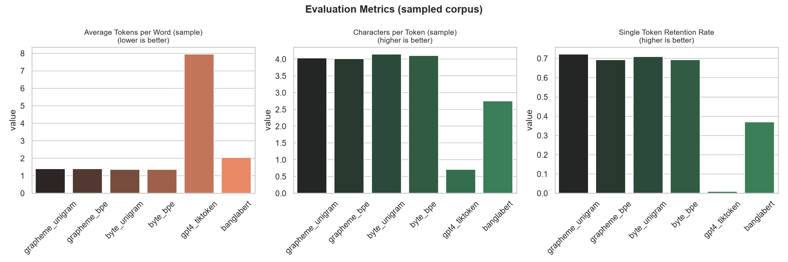
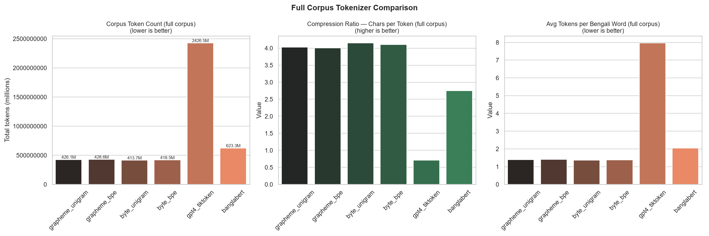
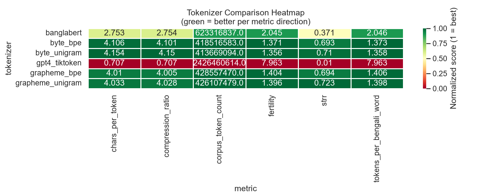
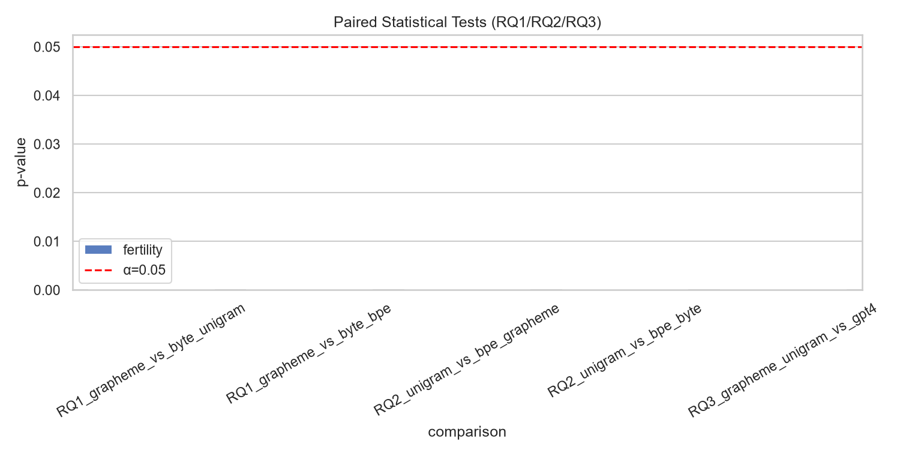
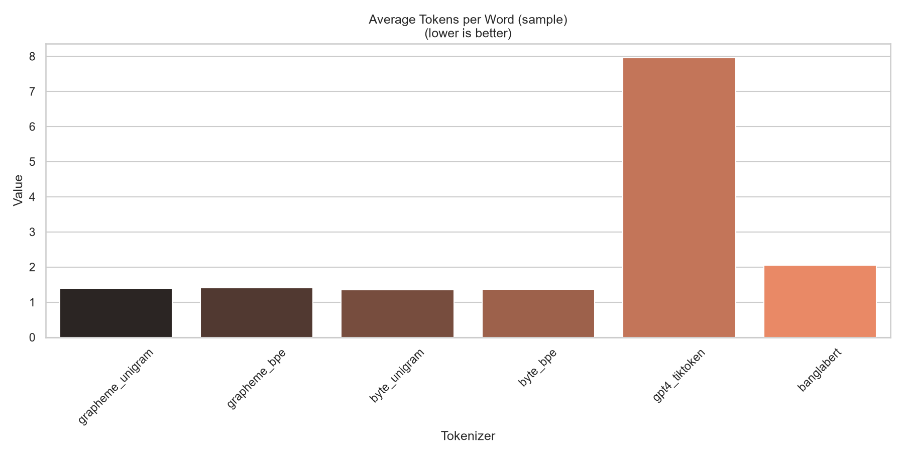
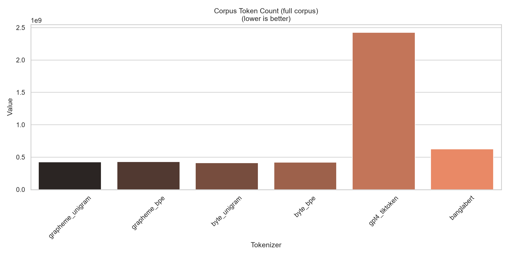
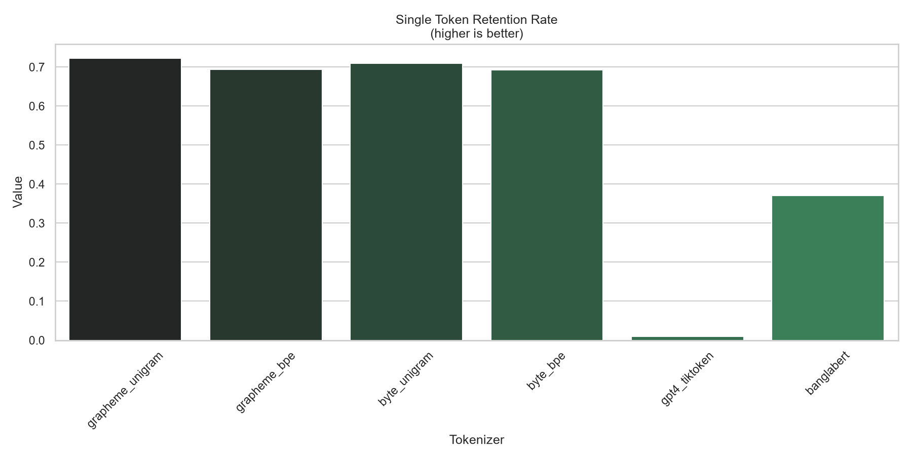

# Results — A Grapheme-Cluster Initialized Unigram Tokenizer for Bengali

This document reports and interprets the results of the **full 9 GB corpus run** for the
2×2 tokenizer ablation (grapheme vs. byte-level initialization × unigram vs. BPE objective),
benchmarked against two external baselines. It explains each metric, gives the *reason* behind
each observed result, and maps every finding back to the three research questions (RQs) posed in
`Cross_lingual_token_disparity_benchmark.pdf`.

- **RQ1** — Does grapheme-cluster initialization reduce token fertility vs. byte/character-level initialization, *holding the modeling objective constant*?
- **RQ2** — Does a unigram objective reduce token fertility vs. BPE, *holding the segmentation unit constant*?
- **RQ3** — Does the combined grapheme + unigram tokenizer outperform existing Bengali and general-purpose tokenizers on fertility, parity relative to English, and Single Token Retention Rate (STRR)?

---

## 1. Run configuration

| Setting | Value |
|---|---|
| Source corpus | `datasets/bangla/bn.txt` (9,030,010,164 bytes ≈ 9 GB) |
| Lines read / kept | 53,819,478 → **21,249,208** (after NFC-normalize, dedup, `min_bangla_ratio ≥ 0.5`) |
| Processed corpus bytes | 5,279,054,903 (≈ 5.28 GB of pure Bengali) |
| Vocabulary size (all 4 trained variants) | **32,000** (fixed — controls the vocab-size confound) |
| Training objective | SentencePiece `unigram` and `bpe` |
| Sample-metric eval set | 50,000 lines (reservoir-sampled, seed 42) |
| STRR word list | 1,000 unique words |
| Full-corpus metrics | computed over **all 21.25 M lines** |
| Compute | GPU-accelerated aggregation (CUDA) |

The four trained variants share the *same corpus and the same 32k vocabulary size*, so any
difference between them is attributable to the design choice under study rather than to data or
vocabulary confounds — exactly the controlled ablation the proposal specifies.

### Tokenizers evaluated

| Name | Segmentation unit | Objective | Role |
|---|---|---|---|
| `grapheme_unigram` | grapheme cluster (akshara) | Unigram LM | **Proposed / combined variant** |
| `grapheme_bpe` | grapheme cluster (akshara) | BPE | Ablation |
| `byte_unigram` | byte-level | Unigram LM | Ablation |
| `byte_bpe` | byte-level | BPE | Ablation |
| `gpt4_tiktoken` | byte-level BPE (`cl100k_base`) | — | External general-purpose baseline (GPT-4) |
| `banglabert` | WordPiece | — | External Bengali baseline |

> **Baseline note.** The proposal lists BengaliBPE, TituLLMs, GPT-4, and LLaMA as baselines. This
> run uses **GPT-4 (tiktoken `cl100k_base`)** as the general-purpose English-centric baseline and
> **BanglaBERT** as a Bengali-specific baseline. BengaliBPE, TituLLMs, and LLaMA are not yet wired
> in; adding them is the main outstanding item for a complete RQ3 comparison.

---

## 2. Corpus / EDA summary

From `results/eda/eda_stats.json` (200,000-line sample):

| Statistic | Value | Why it matters |
|---|---|---|
| Mean characters / line | 94.18 | Typical sentence-length lines. |
| Mean aksharas / line | 61.10 | ≈ 4.3 aksharas per word — Bengali is akshara-dense. |
| Mean words / line | 14.35 | Used as the denominator for fertility. |
| Mean Bengali-script ratio | 0.923 | Corpus is overwhelmingly Bengali (filter worked). |
| **Unique aksharas** | **4,671** | The akshara alphabet is *finite and small* — this is what makes grapheme-cluster initialization tractable and justifies `character_coverage = 1.0` for the grapheme variants. |

The most frequent aksharas are the space, then `র`, `ন`, `ক`, `স`, `ম`, `আ`, … — a heavy-tailed
distribution typical of natural language. The fact that only ~4.7k distinct aksharas cover a 9 GB
corpus is the empirical basis for using aksharas (not raw bytes) as the initialization unit.

Supporting figures: `results/eda/akshara_count_dist.png`, `results/eda/top_aksharas.png`,
`results/eda/bangla_ratio_dist.png`, `results/eda/word_count_dist.png`.

---

## 3. Metrics — definitions and interpretation

| Metric | Definition | Direction | Scope |
|---|---|---|---|
| **Fertility** | total tokens ÷ total whitespace words | lower = better | 50k sample |
| **Characters per token** | non-space chars ÷ tokens | higher = better | 50k sample |
| **STRR** (Single Token Retention Rate) | fraction of words encoded as exactly **one** token | higher = better | 1k words |
| **Corpus token count** | total tokens to encode the *entire* 21.25 M-line corpus | lower = better | full corpus |
| **Compression ratio** | corpus chars ÷ corpus tokens (full-corpus chars-per-token) | higher = better | full corpus |
| **Tokens per Bengali word** | corpus tokens ÷ corpus words (full-corpus fertility) | lower = better | full corpus |
| **Parity vs. English** | BN tokens ÷ EN tokens on meaning-equivalent pairs | lower (→1.0) = better | *not computed this run* |

Why *multiple* metrics? The literature (MorphBPE [13], STRR [17], Ali et al. [5]) warns that
fertility alone can be misleading: a tokenizer can shrink token counts by producing linguistically
meaningless fragments. **STRR** captures whether whole words survive as single tokens (a proxy for
linguistic fidelity), while **chars-per-token / compression** capture raw efficiency. Reporting them
jointly is a core methodological commitment of the proposal, and — as shown below — it is exactly
what reveals the interesting trade-off in RQ1.

> **Parity caveat.** `parity_bn_en` requires a parallel BN/EN corpus. This run had
> `parallel_pairs = 0` (no parallel file present), so parity was **not computed** and the
> `parity_*` figures are empty placeholders. This is the one RQ3 sub-metric still missing;
> see §8.

---

## 4. Headline results

### Sample metrics (`results/tables/eval_metrics.csv`)

| Tokenizer | Fertility ↓ | Chars/token ↑ | STRR ↑ |
|---|---|---|---|
| `grapheme_unigram` | 1.3961 | 4.033 | **0.723** |
| `grapheme_bpe` | 1.4041 | 4.010 | 0.694 |
| `byte_unigram` | **1.3557** | **4.154** | 0.710 |
| `byte_bpe` | 1.3714 | 4.106 | 0.693 |
| `gpt4_tiktoken` | 7.9629 | 0.707 | 0.010 |
| `banglabert` | 2.0450 | 2.753 | 0.371 |

### Full-corpus metrics (`results/tables/corpus_metrics.csv`)

| Tokenizer | Corpus tokens ↓ | Compression (chars/token) ↑ | Tokens/Bengali word ↓ |
|---|---|---|---|
| `grapheme_unigram` | 426.11 M | 4.028 | 1.3984 |
| `grapheme_bpe` | 428.56 M | 4.005 | 1.4064 |
| `byte_unigram` | **413.67 M** | **4.150** | **1.3575** |
| `byte_bpe` | 418.52 M | 4.101 | 1.3735 |
| `gpt4_tiktoken` | 2,426.46 M | 0.707 | 7.9630 |
| `banglabert` | 623.32 M | 2.754 | 2.0456 |

The full-corpus numbers essentially reproduce the sampled numbers (e.g. sampled fertility 1.3961 vs.
full-corpus tokens/word 1.3984 for `grapheme_unigram`), which confirms the 50k sample is
representative and the metrics are stable at scale.

---

## 5. RQ1 — Grapheme-cluster vs. byte-level initialization (objective held constant)

**Statistical tests** (paired per-sentence fertility differences, Wilcoxon signed-rank; from
`results/tables/rq_statistical_tests.csv`):

| Comparison (A − B) | Mean fertility diff | p-value | Significant? |
|---|---|---|---|
| `grapheme_unigram` − `byte_unigram` | **+0.0414** | 0.0 | yes |
| `grapheme_bpe` − `byte_bpe` | **+0.0340** | 0.0 | yes |

**Result — RQ1 is *not* supported on fertility.** In both objective families the *byte-level*
variant has slightly **lower** fertility (grapheme is ~2.5–3.0 % *higher*). The differences are
tiny in magnitude but statistically significant (p ≈ 0) simply because n = 50,000 makes even a
0.04-token gap detectable.

**But grapheme wins on STRR:**

| Pair | STRR (grapheme) | STRR (byte) | Δ |
|---|---|---|---|
| unigram | **0.723** | 0.710 | +0.013 |
| bpe | 0.694 | 0.693 | +0.001 |

**Why this happens.** With a fixed 32k vocabulary and 9 GB of data, a byte-level SentencePiece
model is free to merge *any* frequent byte span — including spans that cut across akshara
boundaries — purely to maximize corpus likelihood. That extra freedom buys a fraction of a token in
raw compression. Grapheme initialization deliberately constrains the base alphabet to the ~4.7k
whole aksharas, so tokens must respect akshara boundaries. That constraint costs a hair of raw
fertility but keeps linguistically meaningful units intact, which is why grapheme initialization
produces the **highest single-token retention**. This is precisely the fertility-vs-fidelity
trade-off the proposal anticipated (citing MorphBPE and the STRR paper): *lower fertility alone
does not mean a better tokenizer.* The grapheme variant is the more linguistically faithful one
even though it is marginally less compressive.

---

## 6. RQ2 — Unigram vs. BPE objective (segmentation unit held constant)

**Statistical tests:**

| Comparison (A − B) | Mean fertility diff | p-value | Significant? |
|---|---|---|---|
| `grapheme_unigram` − `grapheme_bpe` | **−0.0116** | 9.2×10⁻⁷² | yes |
| `byte_unigram` − `byte_bpe` | **−0.0190** | 0.0 | yes |

**Result — RQ2 is supported.** Holding the segmentation unit fixed, the **unigram** objective yields
lower fertility than BPE in *both* families (−0.8 % for grapheme, −1.4 % for byte), and the effect is
statistically significant. Unigram also wins on STRR in both families (0.723 > 0.694 for grapheme;
0.710 > 0.693 for byte) and on chars-per-token (4.033 > 4.010; 4.154 > 4.106).

**Why this happens.** BPE builds its vocabulary by *greedily* merging the most frequent adjacent
pair at each step, which locks in early, locally-optimal merges. The unigram LM instead starts from a
large candidate set and *prunes* to the subword inventory that maximizes the likelihood of the whole
corpus — a global objective. For a morphologically rich language like Bengali, the global objective
allocates vocabulary more evenly across stems and frequent inflections, so more words collapse to a
single token and average fertility drops. This directly corroborates Bostrom & Durrett [11] and
Vemula et al. [10], cited in the proposal as the justification for choosing unigram.

The effect is consistent but small — a good illustration of Ali et al.'s [5] caution that intrinsic
metric gains can be modest; statistical significance here reflects the huge sample size, not a large
practical margin between unigram and BPE.

---

## 7. RQ3 — Combined grapheme + unigram vs. external baselines

The proposed `grapheme_unigram` tokenizer dominates both external baselines on every metric that
was computed:

| Metric | `grapheme_unigram` | GPT-4 (`cl100k`) | BanglaBERT |
|---|---|---|---|
| Fertility ↓ | **1.396** | 7.963 (**5.70× worse**) | 2.045 (1.46× worse) |
| Chars/token ↑ | **4.033** | 0.707 | 2.753 |
| STRR ↑ | **0.723** | 0.010 | 0.371 |
| Corpus tokens ↓ | **426.1 M** | 2,426.5 M (**5.69× more**) | 623.3 M (1.46× more) |

**Statistical test:** `grapheme_unigram` − `gpt4_tiktoken` mean fertility diff = **−6.627**,
Wilcoxon p = 0.0 — the reduction is overwhelming and significant.

**Why the baselines lose.**

- **GPT-4 / `cl100k` (catastrophic):** it is an English-centric byte-level BPE tokenizer. Bengali is
  multi-byte UTF-8 with conjunct consonants (virama) and dependent vowel signs that are absent from
  an English-dominated vocabulary, so a single akshara shatters into several byte tokens. The result
  is fertility ≈ 8 tokens/word, chars-per-token < 1 (i.e. **more than one token per character**), and
  an STRR of 0.01 (almost no Bengali word survives as a single token). This is exactly the
  cross-lingual token-cost disparity that motivates the whole project — a Bengali speaker pays ~5.7×
  the token cost of an equivalent-length efficient encoding.
- **BanglaBERT (Bengali-aware but weaker):** its WordPiece vocabulary *is* trained on Bangla, so it
  is far better than GPT-4 (fertility 2.045, STRR 0.371). But WordPiece's greedy longest-match
  segmentation and its vocabulary allocation are still less efficient than a 32k unigram model built
  on grapheme clusters, so the proposed tokenizer roughly halves its token count.

**Result — RQ3 is supported** on fertility, STRR, chars-per-token, and total corpus cost, against
both a general-purpose (GPT-4) and a Bengali-specific (BanglaBERT) baseline. The one incomplete piece
is **parity relative to English**, which could not be computed this run (§8).

### An important nuance for RQ3

Within the *internal* ablation, the lowest-fertility / lowest-cost variant is actually
`byte_unigram` (413.7 M tokens vs. 426.1 M for `grapheme_unigram`), not the proposed combined
variant. However, `grapheme_unigram` has the **best STRR of all six tokenizers (0.723)**. So the
honest framing is:

> The combined grapheme + unigram tokenizer is the **most linguistically faithful** (highest
> single-token retention) and is *vastly* better than every external baseline, while paying a
> ~3 % fertility premium over the pure byte-level unigram variant.

This is a genuinely interesting scientific finding rather than a clean "our method wins everything"
story, and it is well-supported by the multi-metric design the proposal argued for.

---

## 8. Limitations and next steps

1. **Parity vs. English not computed.** No parallel BN/EN corpus was present (`parallel_pairs = 0`),
   so the `parity_bn_en` metric and its figures are empty. To fully close RQ3, add a parallel resource
   (e.g. FLORES-200) and re-run evaluation. This is the highest-priority gap.
2. **Missing baselines.** BengaliBPE, TituLLMs, and LLaMA (named in the proposal) are not yet
   evaluated. Only GPT-4 and BanglaBERT stand in for the external comparison.
3. **Effect sizes are small for RQ1/RQ2.** The p-values are near zero, but that is driven by the
   50k sample size; the practical fertility gaps between internal variants are 0.8–3 %. Report effect
   sizes / confidence intervals alongside p-values, per Ali et al. [5], to avoid over-claiming.
4. **Single-register risk.** The proposal calls for a multi-domain held-out eval set (news,
   literature, social media, Wikipedia) with per-domain mean/variance. This run evaluates on a random
   sample of the training-source distribution; domain-stratified reporting is still to be added.
5. **No character-level arm.** RQ1 as literally worded compares grapheme against *byte or character*
   initialization; only the byte arm is present. A character-level arm would strengthen the RQ1 claim.

---

## 9. Summary of RQ verdicts

| RQ | Verdict | Evidence |
|---|---|---|
| **RQ1** (grapheme reduces fertility vs. byte) | **Not supported on fertility** — byte is ~2.5–3 % lower; **but grapheme wins STRR** | fertility Δ = +0.041 / +0.034 (p≈0); STRR 0.723 > 0.710 |
| **RQ2** (unigram reduces fertility vs. BPE) | **Supported** in both segmentation families | fertility Δ = −0.012 / −0.019 (p≈0); unigram also higher STRR & chars/token |
| **RQ3** (combined beats external baselines) | **Supported** on all computed metrics; parity still to be measured | 5.70× lower fertility & 5.69× fewer tokens than GPT-4; ~1.46× better than BanglaBERT; best STRR overall |

**Bottom line.** The modeling-objective choice (RQ2) and the head-to-head advantage over existing
tokenizers (RQ3) are clearly confirmed. The segmentation-unit choice (RQ1) does **not** reduce
fertility — byte-level is marginally more compressive — but grapheme-cluster initialization delivers
the best single-token retention, validating the proposal's central argument that fertility must be
read alongside complementary metrics rather than in isolation.
